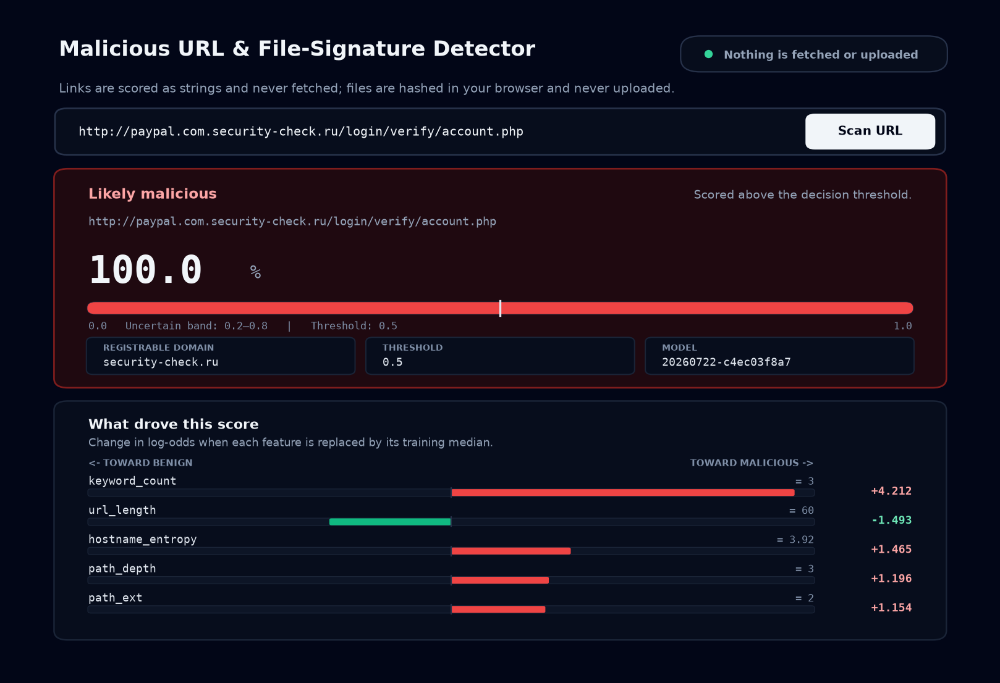
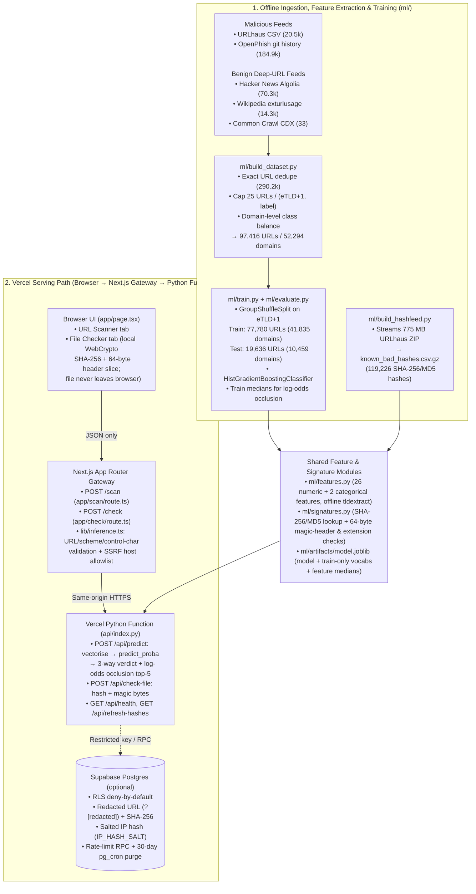

# Malicious URL & File-Signature Detector

[](https://github.com/shreyas-tech7/malicious-url-detector/actions/workflows/ci.yml)
[](LICENSE)
[](https://malicious-url-detector-bice.vercel.app)

A gradient-boosted classifier that detects malicious and phishing URLs from the URL string alone, paired with a browser-side file-signature and magic-byte checker backed by URLhaus hashes.

**Live demo:** <https://malicious-url-detector-bice.vercel.app>

> **Responsible-Use Notice:** This is a **research and defensive tool** built to demonstrate an end-to-end machine learning pipeline (data collection, leakage-aware evaluation, and serverless deployment). It classifies URL strings statically without fetching page content and is not a replacement for a production security control.



Companion docs: **[MODEL_CARD.md](MODEL_CARD.md)** · **[EVALUATION.md](ml/reports/EVALUATION.md)** · **[GENERALIZATION_PROBE.md](ml/reports/GENERALIZATION_PROBE.md)** · **[SECURITY.md](SECURITY.md)** · **[PRIVACY.md](PRIVACY.md)** · **[DATA_SOURCES.md](DATA_SOURCES.md)** · **[DECISIONS.md](DECISIONS.md)**

---

## Quickstart

### 1. Install dependencies and run tests

```bash
python3 -m venv ml/.venv
ml/.venv/bin/pip install --upgrade pip
ml/.venv/bin/pip install -r ml/requirements.txt -r api/requirements.txt httpx

# Run unit and API tests (feature extraction, signatures, inference, privacy guards)
ml/.venv/bin/pytest ml/tests --ignore=ml/tests/test_live_deployment.py -q
```

### 2. Reproduce evaluation metrics, reports, and charts

```bash
# Verifies metrics.json + model.joblib, runs live inference on held-out error samples
# and the 45-URL generalization probe, and regenerates reports + PNG figures:
ml/.venv/bin/python ml/evaluate.py
```

*(To rebuild the raw dataset from live threat feeds from scratch, run `ml/.venv/bin/python ml/data_acquisition.py all && ml/.venv/bin/python ml/build_dataset.py` before `ml/evaluate.py`. Because upstream feeds are rolling snapshots and raw data is gitignored, `ml/evaluate.py` defaults to verifying the committed `ml/reports/metrics.json` and `ml/artifacts/model.joblib` when `ml/data/processed/` is empty.)*

### 3. Run the web app locally

```bash
# Terminal 1 — Python FastAPI inference function on port 8000
ml/.venv/bin/uvicorn api.index:app --host 0.0.0.0 --port 8000

# Terminal 2 — Next.js gateway + UI on port 3000
npm ci
npm run dev
```

Every environment variable in `.env.example` is optional. With none set, the app scores URLs with the committed model bundle (`ml/artifacts/model.joblib`), checks file hashes against the committed local URLhaus snapshot (`ml/artifacts/known_bad_hashes.csv.gz`), and uses in-memory rate limiting.

---

## Headline Metrics

Full evaluation details, charts, and false-positive breakdowns are in **[`MODEL_CARD.md`](MODEL_CARD.md)** and **[`ml/reports/EVALUATION.md`](ml/reports/EVALUATION.md)**.

Evaluated on **19,636 held-out URLs across 10,459 registrable domains (`eTLD+1`) never seen during training** (`77,780` training URLs across `41,835` domains; `0` shared domains and `0` shared URLs across the split):

| Metric | Value (Threshold = `0.50`) |
|---|---:|
| **Accuracy** | **0.9234** (`92.34%`) |
| **Precision** | **0.9225** (`92.25%`) |
| **Recall (TPR)** | **0.9124** (`91.24%`) |
| **F1 Score** | **0.9174** (`91.74%`) |
| **ROC AUC** | **0.9804** |
| **PR AUC** | **0.9795** |

### Confusion Matrix (Threshold = `0.50`, `n = 19,636`)

| | Predicted Benign (`0`) | Predicted Malicious (`1`) | Total |
|---|---:|---:|---:|
| **Actual Benign (`0`)** | **9,776** (`93.30%` TNR) | **702** (`6.70%` FPR) | 10,478 |
| **Actual Malicious (`1`)** | **802** (`8.76%` FNR) | **8,356** (`91.24%` TPR) | 9,158 |

### Threshold Tradeoff and Base-Rate Reality

The evaluation set is **46.64% malicious by construction**, while real web traffic is overwhelmingly benign. Applying Bayes' rule to the measured TPR and FPR shows how precision behaves at realistic base rates ($p$):

| Threshold | Accuracy | Recall (TPR) | FPR | Eval Precision (`p=46.6%`) | Precision @ `p=10%` | Precision @ `p=5%` | Precision @ `p=1%` | Precision @ `p=0.5%` |
|---:|---:|---:|---:|---:|---:|---:|---:|---:|
| **0.50** | 0.9234 | 0.9124 | 0.0670 | **0.9225** | 0.602 | 0.418 | **0.121** | 0.064 |
| **0.70** | 0.9174 | 0.8671 | 0.0387 | 0.9515 | 0.714 | 0.541 | 0.185 | 0.101 |
| **0.80** | 0.9077 | 0.8295 | 0.0240 | 0.9680 | 0.794 | 0.646 | 0.259 | 0.148 |
| **0.90** | 0.8862 | 0.7676 | 0.0101 | 0.9851 | 0.894 | 0.800 | 0.434 | 0.276 |
| **0.95** | 0.8609 | 0.7081 | 0.0055 | 0.9911 | 0.934 | 0.871 | 0.564 | 0.391 |
| **0.99** | 0.7886 | 0.5472 | 0.0004 | **0.9992** | 0.994 | 0.987 | **0.935** | 0.878 |


---

## How It Works

The system has two paths that share `ml/features.py` and `ml/signatures.py` as a single source of truth: an **offline training/evaluation pipeline** and a **Vercel serverless inference path**.



```
OFFLINE PIPELINE (ml/)
  [URLhaus + OpenPhish + Hacker News + Wikipedia + Common Crawl]
        │  ml/data_acquisition.py  (provenance -> ml/data/raw/MANIFEST.json)
        ▼
  [Dedupe -> Cap 25/domain -> Balance by eTLD+1 domain (97,416 URLs)]
        │  ml/build_dataset.py + ml/features.py (28 lexical/structural/categorical features)
        ▼
  [Domain-Grouped 80/20 Split -> HistGradientBoostingClassifier]
        │  ml/train.py + ml/evaluate.py
        ▼
  ml/artifacts/model.joblib  +  ml/artifacts/known_bad_hashes.csv.gz

VERCEL SERVING PATH (app/ + api/)
  Browser (app/page.tsx)
    │  URL string OR client-computed SHA-256 + 64-byte header sample
    ▼
  Next.js App Router Gateway (POST /scan, POST /check, lib/inference.ts)
    │  Validates length <= 2048, http/https scheme, no control chars, allowlisted Host
    ▼
  Python Serverless Function (api/index.py, FastAPI owning /api/*)
    ├── Imports ml/features.py + loads ml/artifacts/model.joblib
    │     Scores URL -> malicious (>=0.80) / uncertain ([0.20, 0.80)) / benign (<0.20)
    │     Computes per-prediction top-5 feature attributions via log-odds occlusion
    ├── Imports ml/signatures.py + loads known_bad_hashes.csv.gz
    │     Checks hash (Supabase -> local fallback) + filename/MIME/magic-byte mismatches
    └── Optional Supabase Postgres (supabase/schema.sql)
          Appends query-redacted URL (?[redacted]), url_sha256, salted IP hash, rate limits
```

---

## Engineering Decisions

Full log in **[`DECISIONS.md`](DECISIONS.md)**. The most consequential choices:

1. **String-only URL classification (no fetching or DNS resolution):** A backend that fetches user-submitted URLs is an SSRF primitive that can be pointed at cloud metadata (`169.254.169.254`) or internal networks. Scoring only the URL string eliminates SSRF by design, and `tldextract` is pinned with `suffix_list_urls=()` and `cache_dir=None` so cold starts never make network requests or write to Vercel's read-only filesystem.
2. **Client-side file hashing and a 64-byte header ceiling:** `POST /check` refuses file uploads. The browser hashes the file locally via WebCrypto (`SHA-256`) and slices at most the first 64 bytes for magic-number verification (`MZ`, `\x7fELF`, `%PDF`). A 250 MB binary and a 200-byte file produce the same ~250-byte request payload.
3. **Deep benign URLs instead of bare Tranco domains:** Tranco lists bare domains (`bbc.com`), whereas URLhaus and OpenPhish list full URLs with paths (`http://1.2.3.4:8080/bins/mirai.arm7`). Training bare domains against full URLs lets `path_length > 0` separate the classes with fake `99%+` precision that collapses on real links. Benign URLs are therefore collected from Hacker News submissions and Wikipedia external links (`86.5%+` with real paths).
4. **Domain-grouped train/test split (`eTLD+1`):** Phishing campaigns emit hundreds of sibling URLs on a single domain. Grouping the split by registrable domain (`GroupShuffleSplit`) ensures zero domains cross the train/test boundary. A naive random row split on the same dataset inflates precision by `+1.63` percentage points (`0.9388` vs `0.9225`) and recall by `+2.57` pp (`0.9381` vs `0.9124`).
5. **Ablating Tranco reputation features in the shipped model:** Because benign URLs were sampled from well-ranked sites, `in_tranco` and `tranco_tier` partly restate the label (`+0.0073` precision in ablation) and turn the classifier into a domain allowlist that penalizes every new domain outside the top 1M. They are disabled (`include_reputation=False`) in the shipped model.
6. **Three-valued verdicts (`uncertain` in `[0.20, 0.80)`):** On the held-out set, `14.1%` of URLs land in `[0.20, 0.80)` and account for `65.9%` of all mistakes. Reporting that middle band as `uncertain — worth a second look` cuts the error rate on hard verdicts from `7.66%` to `3.04%`.
7. **Log-odds occlusion for local explanations:** Replacing a feature with its training median in probability space produces `~0.0001` deltas when `score` is near `0` or `1` due to sigmoid saturation. Computing occlusion deltas on `model.decision_function()` (log-odds) keeps feature rankings informative even on confident predictions.
8. **URL redaction, truncation, and append-only RLS:** Submitted URLs often contain reset tokens or session IDs in query strings, fragments, or userinfo. Before logging, `_redact_url()` strips `user:pass@` credentials, replaces `?query` and `#fragment` with `[redacted]`, and truncates stored paths to 256 characters while keeping `SHA-256(url)` for deduplication. Client IPs are salted-hashed (`SHA-256(IP_HASH_SALT + ":" + ip)`) or dropped if `IP_HASH_SALT` is unset. The server runs on a restricted Supabase key whose RLS policy allows `INSERT` on `predictions` but denies `SELECT`, `UPDATE`, and `DELETE`, so a leaked server key cannot read back a single logged submission.

---

## What I Learned

1. **A 92% precision metric on a balanced test set is a 12% precision metric in production unless you move the threshold.** At the default `0.50` threshold, the classifier's false-positive rate is `6.70%` (`702 / 10,478`). In a balanced `46.6%`-malicious test set, `8,356` true positives easily outweigh `702` false positives (`92.25%` precision). At a realistic `1%` malicious base rate, `6.70%` of the `99%` benign majority outnumbers true detections roughly 7 to 1 (`12.1%` precision). Raising the decision threshold to `0.99` drops FPR to `0.038%` (`4 / 10,478`) and restores precision at a `1%` base rate to `93.5%`, trading recall down to `54.7%`.
2. **A leakage-free domain split still only tests the distribution your feeds sampled.** With Hacker News as the sole benign source, the model achieved `94.05%` held-out precision while scoring `https://github.com/python/cpython/blob/main/Lib/json/decoder.py` at `0.97` malicious and a restaurant's `/menu/starters.php` at `0.955`. URLhaus is full of paths ending in file extensions (`/bins/mirai.arm7`) and OpenPhish is full of `.php` endpoints, whereas Hacker News links are modern extensionless routes over HTTPS. Adding `path_ext` as a categorical feature and adding Wikipedia external links (older `.php`/`.asp`/`.htm` and plain `http` citations) fixed those false positives and lowered headline precision from `0.9405` to `0.9225` because the benign test set became harder and more realistic.
3. **Substring matching on brand and keyword lists creates high-confidence false positives on compound words.** Inspecting the top held-out errors with log-odds occlusion showed `https://jorviksoftware.cc/utilities/rainbowapple` scoring `0.987` because `"apple"` is a substring of `"rainbowapple"` (`brand_outside_domain = 1.0`, `+2.37` log-odds), and `http://members.authorsguild.net/betsyhaynes/` scoring `0.987` because `"auth"` is a substring of `"authorsguild"` (`keyword_count = 1.0`, `+2.59` log-odds). Token-boundary aware matching is the clear next improvement for feature extraction.
4. **String-only classification hits a hard ceiling on non-English hyphenated small-business domains.** URLs like `https://clinicadental-sanchez.es/tratamientos/implantes` (`0.910`) and `https://www.ryokan-yamamoto.jp/rooms/standard.html` (`0.876`) share the exact lexical shape of localized phishing domains (hyphenated domain label, country-code TLD, multi-segment path). Distinguishing them requires signals outside the URL string, such as domain registration age or passive DNS history.
5. **Security hardening can silently break production paths that unit tests never exercise.** Pinning the Next.js gateway's backend target to `VERCEL_URL` to prevent Host-header SSRF caused `POST /scan` to return Vercel's 401 Deployment Protection HTML login page in production, because `VERCEL_URL` is the deployment-specific protected hostname rather than the public alias. Similarly, sending `Prefer: return=minimal` to Supabase PostgREST caused the rate-limit RPC to return an empty body, silently falling back to per-instance memory counters. Both bugs required live-deployment integration tests (`ml/tests/test_live_deployment.py`) and direct RPC verification to catch.

---

## Repository Structure

```
├── MODEL_CARD.md              Problem, datasets, 28 features, split, metrics, threshold & FP analysis
├── README.md                  Overview, quickstart, architecture diagram, decisions, lessons learned
├── SECURITY.md                URL sanitization, redaction/hashing policy, responsible use, 3 audit passes
├── PRIVACY.md                 Data stored, query/credential redaction, 30-day pg_cron retention, RLS
├── DATA_SOURCES.md            Dataset provenance, terms of use, and sampling methodology
├── DECISIONS.md               Engineering log of architectural and ML decisions
├── LICENSE                    MIT License
├── api/
│   ├── index.py               FastAPI serverless function (/api/predict, /api/check-file, /api/health)
│   └── requirements.txt       Pinned runtime dependencies for Vercel Python Function
├── app/                       Next.js App Router UI and validating gateway (/scan, /check)
├── lib/inference.ts           Gateway URL validation, control-byte filtering, SSRF host allowlist
├── ml/
│   ├── features.py            Shared URL feature extraction (single source of truth for train & serve)
│   ├── signatures.py          Shared SHA-256/MD5 hash lookup and static file metadata/magic checks
│   ├── data_acquisition.py    Resumable feed collectors -> ml/data/raw/MANIFEST.json
│   ├── build_dataset.py       Deduplication, per-domain capping (25), domain-level balancing
│   ├── build_hashfeed.py      Streaming parser for the 775 MB URLhaus payload hash ZIP
│   ├── train.py               Domain-grouped split + HistGradientBoostingClassifier training
│   ├── evaluate.py            Reproducible evaluation, leakage audit, threshold sweep, chart generator
│   ├── generalization_probe.py Out-of-distribution smoke test on 45 hand-written URLs
│   ├── artifacts/             Committed model.joblib and known_bad_hashes.csv.gz
│   ├── reports/               EVALUATION.md, GENERALIZATION_PROBE.md, metrics.json, figures/*.png
│   └── tests/                 Pytest suite for features, signatures, API, privacy, and live deploy
├── scripts/
│   └── check-bundle-size.mjs  CI guard enforcing headroom below Vercel's 250 MB function limit
└── supabase/schema.sql        Idempotent RLS-first schema, validating RPCs, pg_cron retention
```

---

## License

Code in this repository is released under the [MIT License](LICENSE). Source datasets (URLhaus CC0, OpenPhish community feed, Tranco, Wikipedia, Common Crawl) remain under their respective project terms documented in [`DATA_SOURCES.md`](DATA_SOURCES.md) and [`ml/data/raw/MANIFEST.json`](ml/data/raw/MANIFEST.json).
