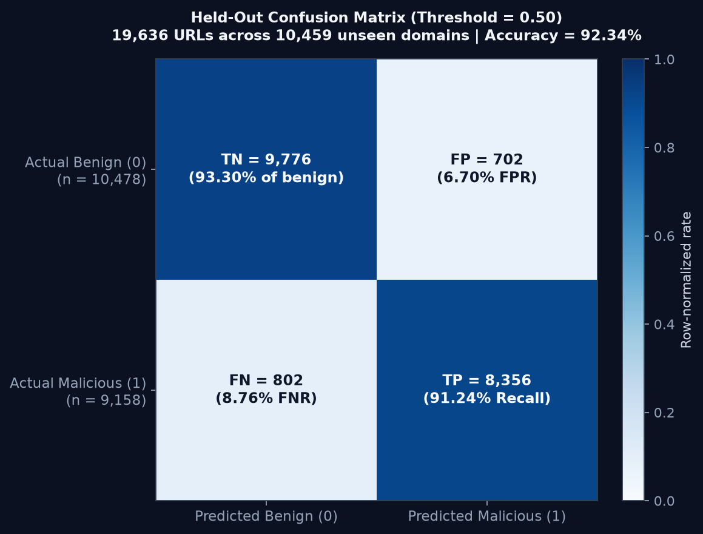
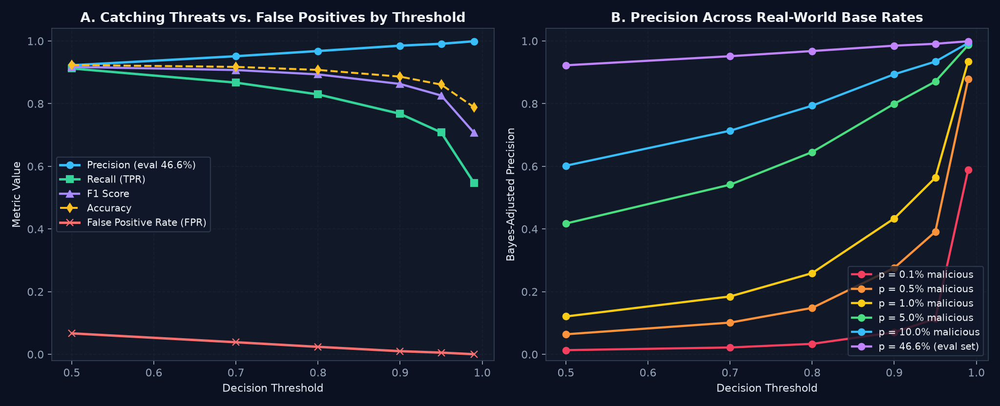
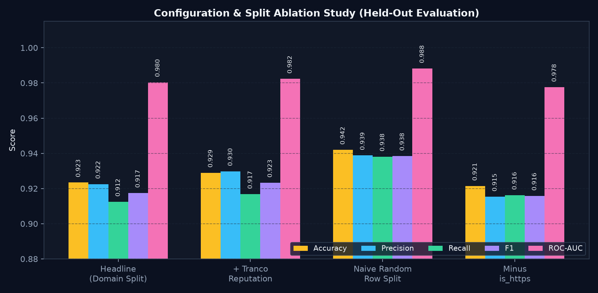
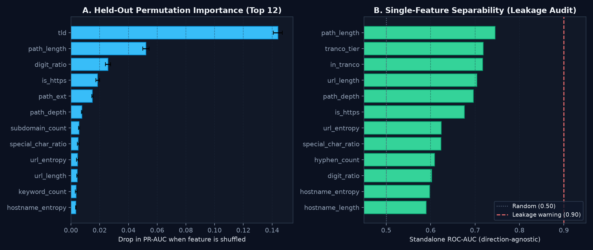

# Evaluation

_Generated by `ml/evaluate.py` (metrics timestamp: `2026-07-22T00:17:59.380446+00:00`). Every number and chart on this page is computed from real held-out evaluation outputs and live execution of `ml/artifacts/model.joblib`; none are estimated._

## Dataset

| | |
|---|---|
| Rows (final) | 97,416 |
| Malicious | 46,560 (47.8%) |
| Benign | 50,856 (52.2%) |
| Distinct registrable domains | 52,294 |
| Domains appearing in both classes | 79 |
| Rows before capping/balancing | 290,164 |

Sources: URLhaus (malware distribution), OpenPhish incl. mined feed history (phishing), Hacker News via Algolia (benign), Wikipedia external links (benign), Common Crawl (benign, best-effort). See `ml/data/raw/MANIFEST.json` for endpoints, licences and fetch timestamps.

URLs per (domain, label) are capped at 25 and the classes are balanced **by domain**, so a handful of large campaigns cannot dominate.

## Methodology

**Split: grouped by registrable domain (eTLD+1).** Every URL sharing an eTLD+1 goes entirely into train or entirely into test. Campaigns emit hundreds of near-identical URLs on one host; under a random row-level split those siblings appear on both sides and the test set measures memorisation. The `random_split` row below quantifies exactly that.

**Imbalance** is handled with `class_weight="balanced"` in addition to the domain-level balancing done at dataset build time.

**Model:** `HistGradientBoostingClassifier`, early stopping on a 15% validation slice of the training data.

## Headline result

On the held-out set of **19,636 URLs** spanning **10,459 domains never seen in training**:

| Metric | Value |
|---|---|
| **Accuracy** | **0.9234** |
| **Precision** | **0.9225** |
| **Recall** | **0.9124** |
| **F1** | **0.9174** |
| **ROC-AUC** | **0.9804** |
| **PR-AUC** | **0.9795** |

Confusion matrix (threshold 0.5):

| | predicted benign | predicted malicious |
|---|---|---|
| **actually benign** | 9,776 | 702 |
| **actually malicious** | 802 | 8,356 |



## What that precision means at a realistic base rate

**Read this before quoting 0.92 anywhere.** Precision is a function of prevalence, and the evaluation set is **46.6% malicious by construction**. Real traffic is overwhelmingly benign.

Applying Bayes' rule to the *measured* TPR and FPR from the confusion matrix above:

```
precision = (p x TPR) / (p x TPR + (1 - p) x FPR)
```

TPR and FPR are properties of the model at a given threshold and do not move with prevalence. Precision does. The same model, unchanged, at each assumed real-world malicious rate:

| Threshold | FPR | p=0.1% | p=0.5% | p=1.0% | p=5.0% | p=10.0% | p=46.6% (this eval) |
|---|---|---|---|---|---|---|---|
| 0.50 | 0.0670 | 0.013 | 0.064 | 0.121 | 0.418 | 0.602 | **0.922** |
| 0.70 | 0.0387 | 0.022 | 0.101 | 0.185 | 0.541 | 0.714 | **0.951** |
| 0.80 | 0.0240 | 0.034 | 0.148 | 0.259 | 0.646 | 0.794 | **0.968** |
| 0.90 | 0.0101 | 0.071 | 0.276 | 0.434 | 0.800 | 0.894 | **0.985** |
| 0.95 | 0.0055 | 0.114 | 0.391 | 0.564 | 0.871 | 0.934 | **0.991** |
| 0.99 | 0.0004 | 0.589 | 0.878 | 0.935 | 0.987 | 0.994 | **0.999** |

**At the default 0.5 threshold and a 1% true malicious rate, precision is 0.121** — roughly 7 false alarms for every real detection. That is not a defect in the model; it is what a 6.7% false-positive rate does when negatives outnumber positives 99 to 1.

The lever is the threshold, and the table shows it working: at t=0.99 the false-positive rate falls to 0.0004, which lifts precision at a 1% base rate to 0.935 — at the cost of recall (0.547 vs 0.912). Any real deployment should pick its operating point from this table and its own estimate of prevalence, not from the headline number.



## Configuration comparison

| Configuration | Accuracy | Precision | Recall | F1 | ROC-AUC | PR-AUC | Test rows |
|---|---|---|---|---|---|---|---|
| headline (domain split, no reputation) | 0.9234 | 0.9225 | 0.9124 | 0.9174 | 0.9804 | 0.9795 | 19,636 |
| + Tranco reputation features | 0.9289 | 0.9298 | 0.9168 | 0.9232 | 0.9823 | 0.9815 | 19,636 |
| naive random row split | 0.9420 | 0.9388 | 0.9381 | 0.9385 | 0.9883 | 0.9875 | 19,449 |
| headline minus `is_https` | 0.9214 | 0.9153 | 0.9162 | 0.9158 | 0.9776 | 0.9765 | 19,636 |



**Reading this table.** The random split scores +0.0163 precision against the domain-grouped one. That difference is not a better model; it is the same model being graded on URLs whose siblings it already memorised. It is the number this project would have reported had the split been done naively.

Adding the Tranco reputation features moves precision +0.0073. That gain is not trustworthy either: the benign class was *sampled from* Tranco-ranked domains, so `in_tranco` largely restates the label. A model leaning on it degrades into a domain whitelist and fails on the first legitimate site outside the list. The headline configuration therefore has these features **off**.

Dropping `is_https` costs -0.0072 precision and +0.0038 recall. The model does lean on it, but does not collapse without it — the remaining lexical and structural signals carry most of the load.

## Leakage audit

Checks run before trusting any of the above:

| Check | Result |
|---|---|
| Exact duplicate URL strings in dataset | 0 |
| Domains present in both train and test | 0 |
| URL strings present in both train and test | 0 |
| Highest single-feature AUC | 0.7450 |

The last row is the important one. If any single feature scored near 1.0 on its own, the task would be solvable without a model and the dataset would be suspect. Top single-feature AUCs:

| Feature | AUC alone |
|---|---|
| `path_length` | 0.7450 |
| `tranco_tier` | 0.7183 |
| `in_tranco` | 0.7171 |
| `url_length` | 0.7042 |
| `path_depth` | 0.6967 |
| `is_https` | 0.6760 |
| `url_entropy` | 0.6237 |
| `special_char_ratio` | 0.6232 |

## What the model actually uses

Permutation importance on the held-out set (drop in average precision when the feature is shuffled):

| Feature | Importance |
|---|---|
| `tld` | 0.1440 ± 0.0032 |
| `path_length` | 0.0522 ± 0.0022 |
| `digit_ratio` | 0.0258 ± 0.0019 |
| `is_https` | 0.0186 ± 0.0013 |
| `path_ext` | 0.0149 ± 0.0004 |
| `path_depth` | 0.0076 ± 0.0004 |
| `subdomain_count` | 0.0056 ± 0.0004 |
| `special_char_ratio` | 0.0051 ± 0.0007 |
| `url_entropy` | 0.0045 ± 0.0008 |
| `url_length` | 0.0044 ± 0.0004 |
| `keyword_count` | 0.0035 ± 0.0006 |
| `hostname_entropy` | 0.0034 ± 0.0003 |



## Threshold selection

A false positive tells a user a legitimate link is dangerous, which costs trust quickly. Raising the threshold trades recall for precision:

| Threshold | Accuracy | Precision | Recall (TPR) | F1 | FPR | TP | FP | TN | FN | URLs flagged |
|---|---|---|---|---|---|---|---|---|---|---|
| 0.50 | 0.9234 | 0.9225 | 0.9124 | 0.9174 | 0.0670 | 8,356 | 702 | 9,776 | 802 | 9,058 |
| 0.70 | 0.9174 | 0.9515 | 0.8671 | 0.9073 | 0.0387 | 7,941 | 405 | 10,073 | 1,217 | 8,346 |
| 0.80 | 0.9077 | 0.9680 | 0.8295 | 0.8934 | 0.0240 | 7,597 | 251 | 10,227 | 1,561 | 7,848 |
| 0.90 | 0.8862 | 0.9851 | 0.7676 | 0.8629 | 0.0101 | 7,030 | 106 | 10,372 | 2,128 | 7,136 |
| 0.95 | 0.8609 | 0.9911 | 0.7081 | 0.8261 | 0.0055 | 6,485 | 58 | 10,420 | 2,673 | 6,543 |
| 0.99 | 0.7886 | 0.9992 | 0.5472 | 0.7071 | 0.0004 | 5,011 | 4 | 10,474 | 4,147 | 5,015 |

## Per-source breakdown

| Source | n (test) | Recall / FP-rate |
|---|---|---|
| commoncrawl | 30 | 0.0667 (FP-rate) |
| hackernews | 8,259 | 0.0595 (FP-rate) |
| openphish | 7,958 | 0.9036 (recall) |
| urlhaus | 1,200 | 0.9708 (recall) |
| wikipedia | 2,189 | 0.0955 (FP-rate) |

## Error analysis

Highest-confidence false positives (benign, scored malicious):

- `http://thingsmygirlfriendandihavearguedabout.com/` — 0.999 — top drivers: is_https=0.0 (+2.11 log-odds), tld=0.0 (-1.41 log-odds), longest_token_length=37.0 (+1.38 log-odds)
- `http://english.peopledaily.com.cn/data/people/zengqinghong.shtml` — 0.997 — top drivers: url_length=64.0 (-1.57 log-odds), is_https=0.0 (+1.11 log-odds), path_length=31.0 (-0.81 log-odds)
- `https://cogniflow-v2.emergent.host/` — 0.994 — top drivers: hostname_length=26.0 (+1.51 log-odds), digit_ratio=0.0286 (+1.04 log-odds), hostname_entropy=4.027 (+0.89 log-odds)
- `http://replicated.live/blog/follow-up` — 0.99 — top drivers: is_https=0.0 (+4.70 log-odds), tld=46.0 (+1.07 log-odds), subdomain_count=0.0 (+0.76 log-odds)
- `https://jorviksoftware.cc/utilities/rainbowapple` — 0.987 — top drivers: special_char_ratio=0.125 (+2.49 log-odds), brand_outside_domain=1.0 (+2.37 log-odds), longest_token_length=14.0 (+0.52 log-odds)
- `http://members.authorsguild.net/betsyhaynes/` — 0.987 — top drivers: tld=4.0 (-3.69 log-odds), keyword_count=1.0 (+2.59 log-odds), hostname_entropy=3.8868 (+2.34 log-odds)
- `http://replicated.live/blog/worktree` — 0.987 — top drivers: is_https=0.0 (+4.70 log-odds), tld=46.0 (+1.17 log-odds), hostname_entropy=3.3232 (-0.95 log-odds)
- `https://globalresearchspace.com/space#7.65/-16.827/42.731/-35.7/68` — 0.987 — top drivers: digit_ratio=0.2727 (+2.96 log-odds), tld=0.0 (-2.23 log-odds), subdomain_count=0.0 (+1.32 log-odds)

Missed malicious URLs (lowest scored):

- `https://ricardo.erhalt24.com/ad_mart-item/lounge-set-in-top-zustand-sofa-2-clubsessel-tullow-fe837cb6` — 0.0 — top drivers: tld=0.0 (-7.07 log-odds), path_length=73.0 (-6.04 log-odds), url_length=101.0 (-2.00 log-odds)
- `https://dhlexpress.ee/blog/en/post/mission-critical-shipments-how-seven-businesses-found-solutions-that-were-right-for-t` — 0.001 — top drivers: path_length=99.0 (-6.66 log-odds), tld=73.0 (-5.83 log-odds), path_depth=4.0 (+2.33 log-odds)
- `https://promocaodiasdopais.myshopify.com/products/cozinha-suspensa-65cm-escorredor-de-loucas-copos-talheres-organizador-` — 0.002 — top drivers: tld=0.0 (-5.62 log-odds), path_length=80.0 (-5.00 log-odds), url_length=120.0 (-1.91 log-odds)
- `https://dhlexpress.ee/en/terms-and-conditions-2/volumetric-weight-calculator/` — 0.002 — top drivers: tld=73.0 (-5.81 log-odds), path_length=56.0 (-5.77 log-odds), path_depth=3.0 (+1.63 log-odds)
- `https://www.betaspace.dev/am/paiement.php/` — 0.002 — top drivers: tld=6.0 (-7.67 log-odds), longest_token_length=9.0 (-0.77 log-odds), url_entropy=3.8128 (+0.40 log-odds)
- `https://mj-api.kun-ai.com/blog/from-blocky-to-brilliant-improving-video-quality-on-discord-go-live-on-amd-gpus` — 0.002 — top drivers: path_length=85.0 (-6.92 log-odds), tld=0.0 (-5.85 log-odds), hyphen_count=2.0 (+1.65 log-odds)
- `https://mj-api.kun-ai.com/blog/discord-github-help-make-online-hackathons-easier-for-everyone` — 0.003 — top drivers: path_length=68.0 (-6.55 log-odds), tld=0.0 (-5.72 log-odds), hyphen_count=2.0 (+1.75 log-odds)
- `https://dhlexpress.ee/en/starter-hub/additional-service-options/` — 0.003 — top drivers: path_length=43.0 (-4.94 log-odds), tld=73.0 (-4.10 log-odds), path_depth=3.0 (+1.92 log-odds)

## Limitations

Read these before quoting the headline number anywhere.

1. **Benign data still skews technical, and the residual failure mode is measurable.** Hacker News is the largest benign source; Wikipedia external links were added specifically to cover the non-technical, older, non-English web, which cut the worst false positives roughly in half. What survives is documented in [GENERALIZATION_PROBE.md](GENERALIZATION_PROBE.md): legitimate hyphenated non-English domains such as `clinicadental-sanchez.es/tratamientos/implantes` and `ryokan-yamamoto.jp/rooms/standard.html` still score ~0.88-0.91. That is not a bug so much as the ceiling of string-only classification — a hyphenated, non-.com hostname is genuinely the shape phishing uses, and nothing in the URL distinguishes a Spanish dental clinic from an impersonation of one. Resolving it needs domain reputation or registration age, i.e. signals outside the string.

2. **Benign URLs are almost entirely HTTPS (99.4%) while malicious are 60%.** Some of that gap is genuine — malware hosts really do skew plaintext — but some is an artifact of sampling benign URLs from a modern link aggregator. The `no_https_feature` row bounds how much this matters.

3. **The class balance here is not the real-world base rate.** The evaluation set is roughly 50/50. Real traffic is overwhelmingly benign, and precision falls as the positive class gets rarer: at a 1% true malicious rate, the same model's precision would be far below what this table shows. These numbers describe discrimination ability, not deployed performance.

4. **Threat feeds are a biased sample of malice.** URLhaus and OpenPhish contain URLs that were *detected and reported*. Malicious URLs that evade detection are, by definition, absent — so real-world recall against a competent adversary is lower than measured.

5. **Static analysis only.** The classifier sees the URL string and nothing else. It never fetches the page (deliberately — see the SSRF note in the README). A malicious page on a clean-looking URL, or a compromised legitimate site, is invisible to it.

6. **No adversarial evaluation.** An attacker who knows these features can craft URLs to defeat them (use HTTPS, a short path, no keywords, a plausible domain). Nothing here measures robustness to that.

7. **The model decays.** Phishing infrastructure and TLD fashions turn over quickly. Without periodic retraining these numbers will degrade; no drift monitoring is implemented.

8. **Portfolio-grade, not enterprise threat intel.** This demonstrates the full pipeline — data, features, leakage-aware evaluation, serving — and should not be used as a real security control.
